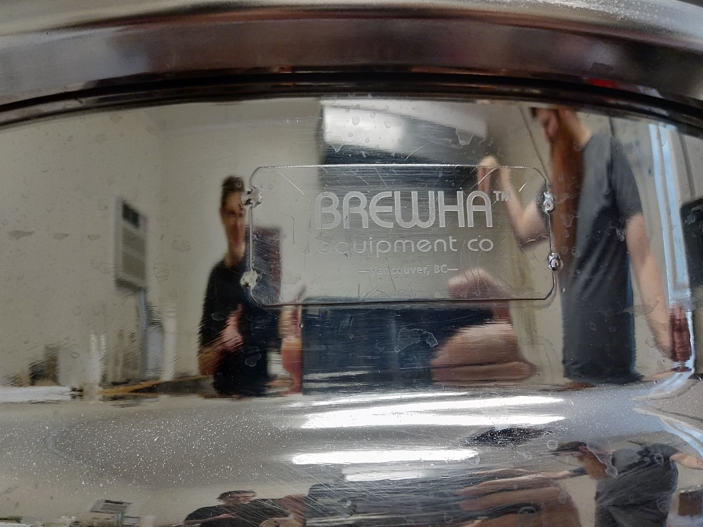
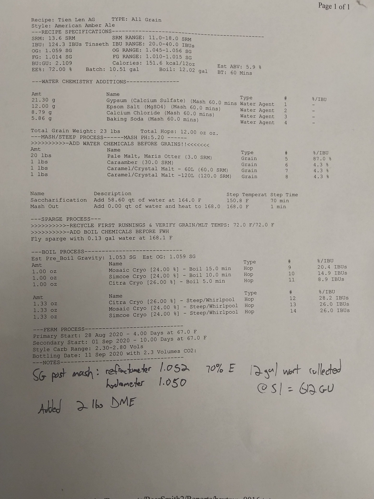
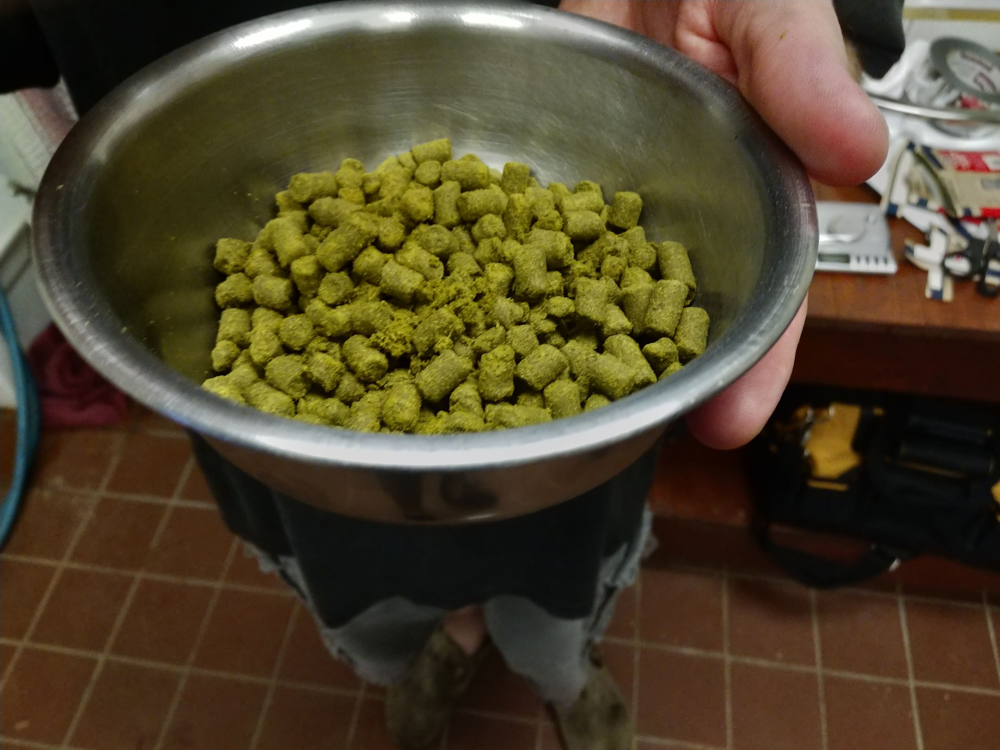
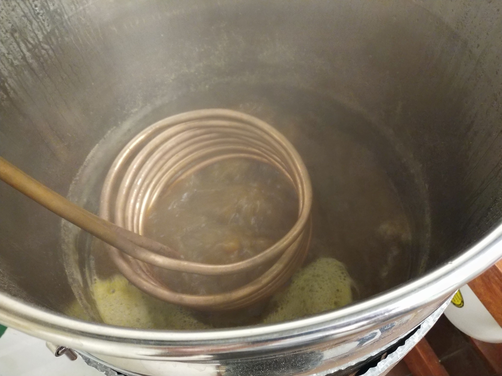
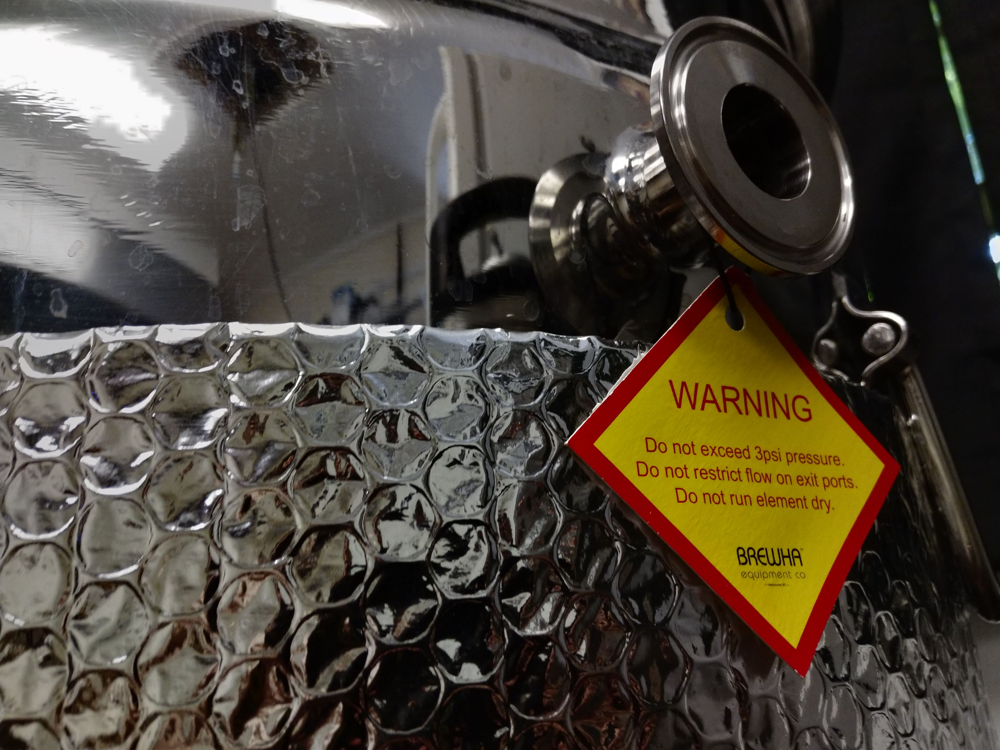
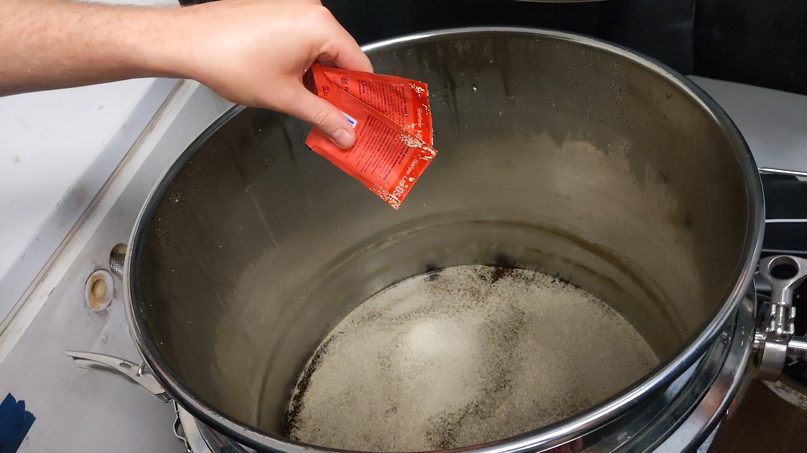
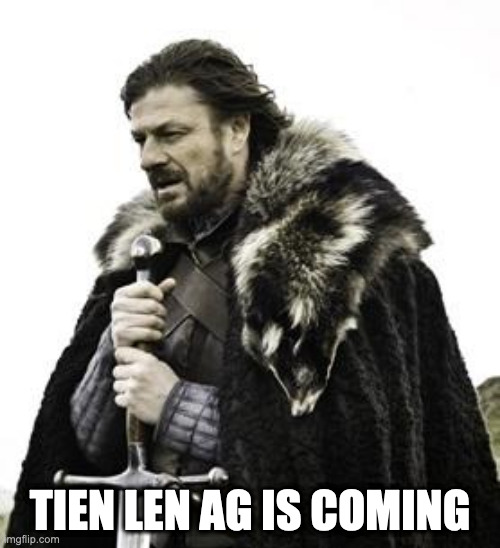
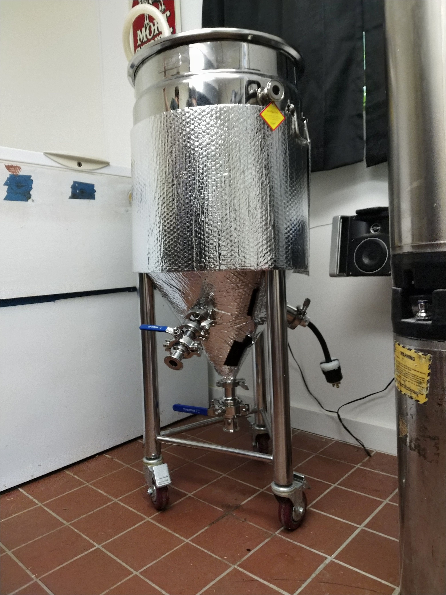

## Coming Roctober 2020 🍻

It was authoritatively decreed at `2020-08-29T05:57:00-05:00` that 1.5 pounds of hops shall burst from 10 gallons.
Immediately, forces of good were dispatched to convene ingredients for a work of love converging on Saturday, Septembeer 5th which will henceforth always be remembeered as **Labor Day**.

## Recipe

*American* Amber Ale? `Steep/Whirlpool`?

> Maybe 😉

## Cryo Hops

The purest sweet resiny sensational goodness... 🤤

## Wanna Cook?

## Warning

Do not exceed, restrict, and/or run with expectations that this beer contains trace amounts of/and/or causes the following side effects:

* awesomeness
* ancient Eureka Shpongle spores
* Khruangbin

## Pitch Dat Yeast

## Bitter Sweet Wort

A richly tantalizing and ominous preview of two glorious flavor profile echelons.
_sip with caution_

## Brace Yourself

## Happy Yeast

On or around 12:00 Z, Septembeer 6th, great gaseous clouds were noted issuing forth from the fermenter blowoff tube, placing the upper bound on fermentation lag time at 15 hours. As of this writing (T+45 hours since pitch) the summated yeast belches are a near constant rolling gurgle. To step inside the brew shed is to dive into a miasmal space of caramel vapor and hop gas.

## Behold the Knowledge

What follows is a glimpse into the past and visions of a possible future:

BeerSmith 2 Recipe Printout - http://www.beersmith.com
Recipe: Tien Len AG
Brewer: 
Asst Brewer: 
Style: American IPA
TYPE: All Grain
Taste: (30.0) 

Recipe Specifications
--------------------------
Boil Size: 12.02 gal
Post Boil Volume: 11.23 gal
Batch Size (fermenter): 10.51 gal   
Bottling Volume: 10.04 gal
Estimated OG: 1.066 SG
Estimated Color: 14.1 SRM
Estimated IBU: 96.6 IBUs
Brewhouse Efficiency: 70.00 %
Est Mash Efficiency: 71.8 %
Boil Time: 60 Minutes

Ingredients:
------------
Amt                   Name                                     Type          #        %/IBU         
21.30 g               Gypsum (Calcium Sulfate) (Mash 60.0 mins Water Agent   1        -             
12.00 g               Epsom Salt (MgSO4) (Mash 60.0 mins)      Water Agent   2        -             
8.79 g                Calcium Chloride (Mash 60.0 mins)        Water Agent   3        -             
5.86 g                Baking Soda (Mash 60.0 mins)             Water Agent   4        -             
20 lbs                Pale Malt, Maris Otter (3.0 SRM)         Grain         5        80.0 %        
1 lbs                 Caraamber (30.0 SRM)                     Grain         6        4.0 %         
1 lbs                 Caramel/Crystal Malt - 60L (60.0 SRM)    Grain         7        4.0 %         
1 lbs                 Caramel/Crystal Malt -120L (120.0 SRM)   Grain         8        4.0 %         
2 lbs                 Light Dry Extract (8.0 SRM)              Dry Extract   9        8.0 %         
2.00 oz               Columbus/Tomahawk/Zeus (CTZ) [17.30 %] - Hop           10       56.1 IBUs     
1.00 oz               Mosaic Cryo [20.70 %] - Boil 15.0 min    Hop           11       16.7 IBUs     
1.00 oz               Simcoe Cryo [26.50 %] - Boil 10.0 min    Hop           12       15.6 IBUs     
1.00 oz               Citra Cryo [25.20 %] - Boil 5.0 min      Hop           13       8.2 IBUs      
1.33 oz               Citra Cryo [25.20 %] - Steep/Whirlpool   Hop           14       0.0 IBUs      
1.33 oz               Mosaic Cryo [20.70 %] - Steep/Whirlpool  Hop           15       0.0 IBUs      
1.33 oz               Simcoe Cryo [26.50 %] - Steep/Whirlpool  Hop           16       0.0 IBUs      
2.0 pkg               Safale American  (DCL/Fermentis #US-05)  Yeast         17       -             
1.67 oz               Citra Cryo [25.20 %] - Dry Hop 0.0 Days  Hop           18       0.0 IBUs      
1.67 oz               Mosaic Cryo [20.70 %] - Dry Hop 0.0 Days Hop           19       0.0 IBUs      
1.67 oz               Simcoe Cryo [26.50 %] - Dry Hop 0.0 Days Hop           20       0.0 IBUs      

Mash Schedule: BREWHA BIAC, Medium Body
Total Grain Weight: 25 lbs
----------------------------
Name              Description                             Step Temperat Step Time     
Saccharification  Add 58.60 qt of water at 163.6 F        150.8 F       70 min        
Mash Out          Add 0.00 qt of water and heat to 168.0  168.0 F       1 min

## We Bought the Ticket, Now Finish the Ride

The prototype reflectix wrap is helping the cold water loop keep all passengers at a comfortable 68.0F, approximately 13 degrees below ambient, and dead-on the temp setpoint

Temps are nice and stable. The blue line shows when the cold water pump was running. It turned off about an hour before this screenshot:

ABV should fall in the 6.0-6.5% range.

TBD: 
* Check SG daily when airlock activity slows, probably starting on 9/10 or 9/11
* After 2 identical SG readings dump yeast cake
* Dry hop with the sweet resin cryo pellets
